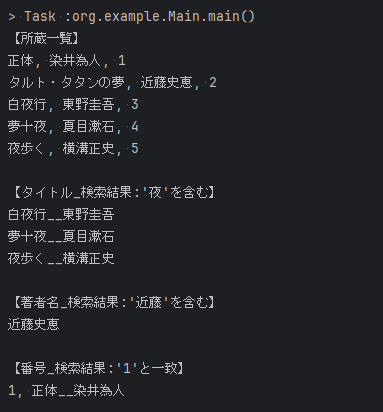
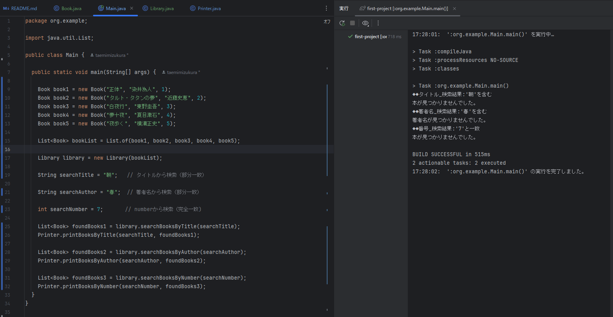

## 12_Javaの命名規則と学習方法

### ソースコード

[Main.java](src/main/java/org/example/Main.java)

### 実行結果

- 検索一致ケース  
  
- 検索不一致ケース  
  

### Javaの命名規則

日本語、英語、アンダーバーとか色々な文字列が使える。基本的には英語使う。コメントはOK。
先頭文字には数字使えない。大文字と小文字は区別される。

- Pascal  
  先頭大文字。一般的な英語の書き方と一緒  
  Main,Greeting,Speaking

- Camel  
  先頭は小文字。言葉の区切りから大文字。メソッド名や変数名に使われることが多い。
  sayHello,numberSecond,studentList

- フィールド名、変数名
  名詞  
  number , message , name , xxList

- メソッド名、動詞  
  say, greet , print, printMessage  
  getXXX、setXXX, countXXX

- 定数
  フィールドとの違いは固定値であること。絶対に変更しないこと。
  全て大文字。Snakeケースを使う場合もある。
  FULL_NAME

- 真偽値、booleanを使うときの名前
  isXXX, hasXXX
  isNumber, isNull

- 命名の仕方  
  適当な名前を付けないこと。誰かに使われることを想定する  
  誰にも絶対に使われない。誰にも見せない。そういったものであれば適当でもいい。  
  長くなってもいい。名前はコンパクトが一番。短く正確に伝わるものが理想。難易度高い  
  長くてもいいので正確であることが大事。短くするのは後。 a,b,cこういう適当な名前はなるべく付けない。正確に。

### 学習方法

1つ1つ理解しながら進める or （おすすめ→）なんとなく理解した状態で次にどんどん進む  
モチベーションの上げ方。前提としてモチベーションに頼らない。 ご褒美を上げる。罰ゲームを作る。自分のさじ加減を、他人に委ねる。

## 課題

図書管理システムを作る。
書籍（Book）を管理する情報（タイトル、著者、番号）を持つオブジェクト（クラス）を作って、そこに情報を格納してください。  
図書館（Library）みたいなものを作って、そこにBookをListで持つようなものを保持する。  
mainメソッドからこのLibraryクラスに対して検索ができるようにする。Libraryクラスは書籍検索の機能を持つ。  
タイトル検索、著名検索、番号検索メソッドをLibraryに持たせる。  
それをmainメソッドから実行して、実行結果をコンソールに出力する。  
